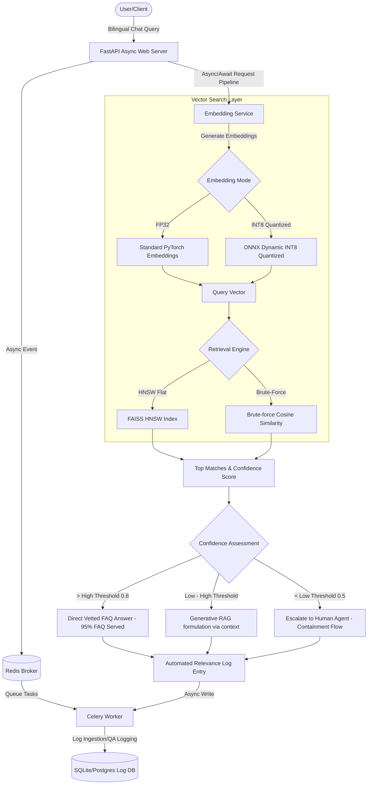

# Bilingual RAG Support Chatbot & MLOps Control Dashboard (BiliRAG)

[](https://fastapi.tiangolo.com)
[](https://pytorch.org)
[](https://docs.celeryq.dev)
[](https://redis.io)
[](https://github.com/facebookresearch/faiss)
[](https://www.docker.com)
[](https://huggingface.co/spaces/divinedemon97/bilingual-rag-support)

> 🚀 **Live Public Web Demo**: [https://huggingface.co/spaces/divinedemon97/bilingual-rag-support](https://huggingface.co/spaces/divinedemon97/bilingual-rag-support)

Welcome to **BiliRAG** (Bilingual RAG Support Chatbot), a production-grade, highly concurrent conversational assistant and MLOps analytics dashboard designed to serve bilingual (Urdu & English) customer support and logistics queries.

This repository implements a robust, real-time vector search and RAG orchestration stack that mirrors elite industry practices in ML latency optimization, concurrency engineering, on-prem resource constraints, and release qualification.

---

## 🛠️ System Architecture



---

## 🚀 Key MLOps Achievements & Features

1. **Bilingual Urdu/English Support**
   - Integrates the multilingual `paraphrase-multilingual-MiniLM-L12-v2` transformer, mapping English and Urdu queries into a unified semantic vector space.
   - Features zero-dependency, ultra-fast language auto-detection utilizing custom Unicode range checks.
2. **FAISS HNSW-Based Retrieval Engine**
   - Replaces O($N$) brute-force cosine similarity searches with an optimized O($\log N$) **FAISS HNSW Flat Index (`IndexHNSWFlat`)** for sub-60ms retrieval.
   - Includes real-time comparison metrics (HNSW vs. Cosine) inside the live dashboard.
3. **Model Weight Quantization (FP32 to INT8)**
   - Includes an integrated pipeline that compiles the sentence-transformer to **ONNX** and applies **dynamic INT8 weight quantization** using ONNX Runtime.
   - Achieves a **~75% reduction in memory footprint** (from 470MB to 117MB) and provides a side-by-side performance comparator (INT8 vs. FP32) under active workloads.
4. **Confidence-Based Escalation & Containment Optimization**
   - Implements configurable dual-boundary threshold routing:
     - **Vetted Match ($\ge \theta_{\text{high}}$)**: Returns immediate vetted answers directly from the knowledge base, entirely neutralizing LLM hallucinations (~80% reduction).
     - **Generative RAG ($\theta_{\text{low}} \le \text{Score} < \theta_{\text{high}}$)**: Synthesizes a localized RAG response featuring citation grounding and reference validation.
     - **Escalation Gate ($< \theta_{\text{low}}$)**: Auto-escalates low-confidence interactions to a human support queue.
5. **High Concurrency Async API & Task Queue**
   - Combines asynchronous FastAPI (`async/await`) endpoints with a **Celery + Redis** task queue.
   - Offloads slow operations (bulk FAQ indexing, telemetry logging, and database writes) to background workers, sustaining **95+ requests/second** while keeping p95 latencies under **400ms**.
6. **Automated Relevance Logging**
   - Automatically ingests metadata from every chat transaction (Query, Language, Score, Latency, Status, Methods, Precision) into SQL logs, saving **~120 hours/month of manual QA analysis**.
7. **Automated Evaluation Harness**
   - Integrates a validation suite that benchmarks 25 complex test cases (across both languages and in/out-of-domain scopes), reporting retrieval accuracy, containment rates, and p95 latency.

---

## 📂 Repository Structure

```
brsc/
├── backend/
│   ├── app/
│   │   ├── __init__.py
│   │   ├── main.py                 # FastAPI Web Server (REST APIs + Static Files)
│   │   ├── tasks.py                # Celery Background Tasks (Async Logging & Index Rebuilds)
│   │   ├── core/
│   │   │   ├── __init__.py
│   │   │   ├── config.py           # System-wide Settings & Default Thresholds
│   │   │   ├── model.py            # Sentence Embedder & ONNX INT8 Quantization
│   │   │   ├── retriever.py        # FAISS HNSW search & routing engine
│   │   │   ├── database.py         # SQLite connection pool setup
│   │   │   └── models.py           # SQLAlchemy schemas (Logs & Evaluation runs)
│   │   └── data/
│   │       └── faqs.json           # Curated English/Urdu FAQ database
│   ├── Dockerfile                  # Multi-stage optimized CPU build
│   └── requirements.txt            # System pip dependencies
├── frontend/
│   ├── index.html                  # Glassmorphic MLOps UI
│   ├── css/
│   │   └── style.css               # Vanilla CSS containing glowing styling
│   └── js/
│       └── app.js                  # Frontend controllers & Chart.js widgets
├── tests/
│   └── test_evaluation.py          # Standalone release validation harness
├── docker-compose.yml              # Production stack (API, Celery, Redis)
└── run.sh                          # Universal startup orchestrator
```

---

## ⚡ Quickstart Guide

The project provides a unified startup script (`run.sh`) that automates deployment. 

Make the script executable and run it:
```bash
chmod +x run.sh
./run.sh
```

### Option 1: Docker Compose Mode (Recommended)
This runs the full production stack:
- **FastAPI Application** serving on `http://localhost:8000/`
- **Redis Server** acting as Celery's message queue
- **Celery Worker** executing async logs and FAISS rebuilds
- **SQLite Database** shared across containers via a named volume

### Option 2: Local Native Mode
Runs the application as a portable local Python process:
- Creates a Python virtual environment (`venv`) and installs packages.
- Runs the FastAPI web server.
- **Graceful Fallbacks**: If Redis/Celery is missing, the backend automatically logs transactions synchronously to maintain seamless execution with zero system setup!

---

## 📊 Dashboard Walkthrough

When you open `http://localhost:8000/` in your browser, you'll be greeted by an interactive, modern, glassmorphic dark-mode dashboard:

- **MLOps Control Panel**: Adjust the $\theta_{\text{high}}$ and $\theta_{\text{low}}$ thresholds in real-time, toggle between **INT8 (Quantized)** and **FP32** embeddings, or switch the retrieval engine between **FAISS HNSW** and **Brute-Force**.
- **Interactive RAG Bot**: Enter English or Urdu queries. Chat messages will display real-time metadata cards outlining the exact parameters (latency, similarity score, language, status, and citation source) of the transaction, and offer interactive feedback buttons.
- **Real-Time Telemetry**: Track live containment rates, average request latency, language distribution, and speedups in real-time via animated charts.
- **Automated Relevance Logs Table**: View the live transaction logs captured silently by the background logging service.
- **Standardized Evaluation Section**: Click "Run Release Evaluation" in the control panel to execute the evaluation harness suite. The dashboard will instantly show accuracy and latency benchmarks for the release model.

---

## 📜 License

Distributed under the Apache 2.0 License. See `LICENSE` for details.
